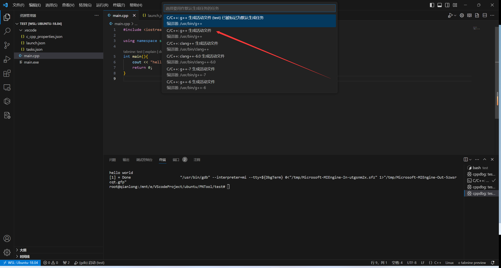
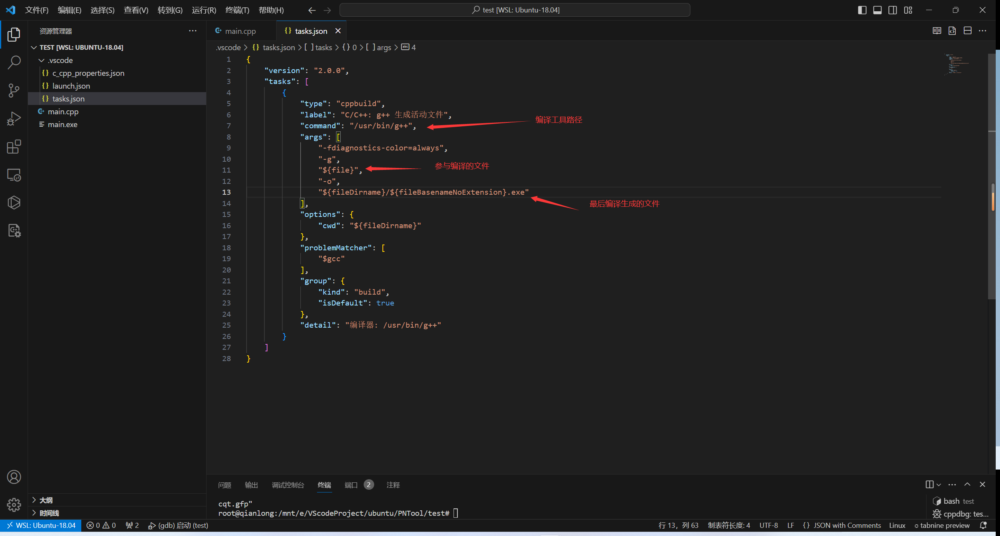
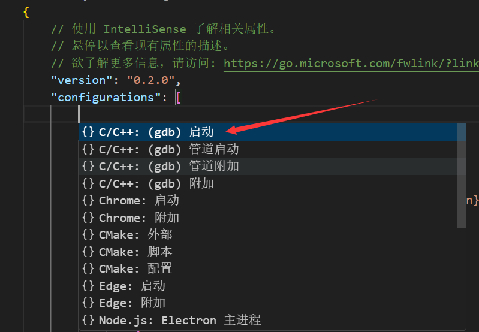
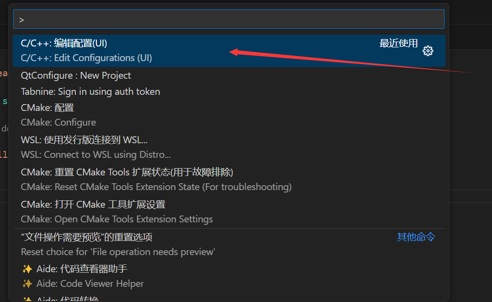
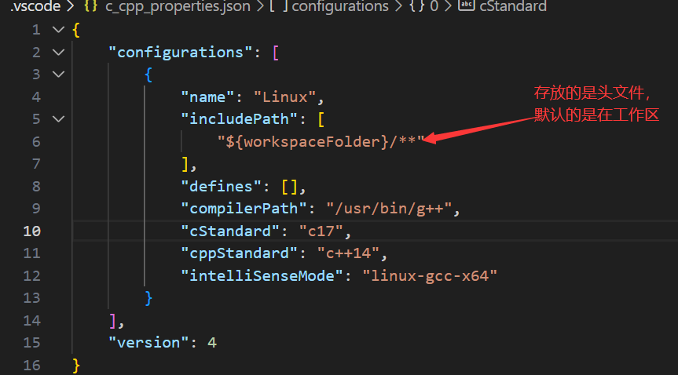
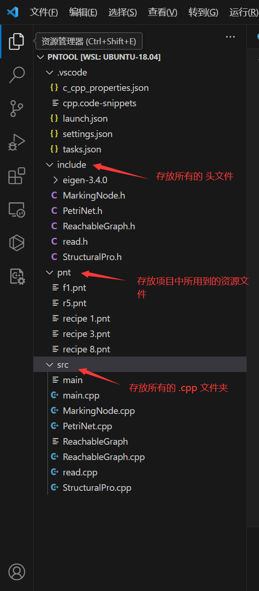

# VS code

## 快捷键：

注释：alt+shift+a   ctrl+/

格式化代码：先选择代码，然后ctrl+k，然后ctrl+f

向下复制一行：shift+alt+⬇

我们通常所说的编译是指将代码转换成可以运行的二进制程序的整个过程。实际上，将源代码文件编译成可运行的二进制的程序分为4个步骤，编译只是其中一个步骤：

- 预处理

  预处理会对文件进行修改，例如，它把#include文件的内容放进程序中，进行一些替换操作。

- 编译

  预处理文件将被翻译成汇编语言

- 汇编

  将汇编代码文件构成所谓的目标文件，这里目标文件都是二进制文件

- 链接

  将所有的目标文件合并到一个二进制文件中

无论是配置单文件还是多文件编译环境，都需要配置三个文件，分别是：tasks.json、launch.json、c_cpp_properties.json。参考[VS Code 配置 C/C++ 编程运行环境](https://blog.csdn.net/qq_42417071/article/details/137438374)

## Linux配置C/C++单文件编译环境

- 配置`tasks.json`文件

  这个文件是用于定义任务配置（如何构建和运行代码），这些任务可以在 VS Code 中运行，例如编译代码、运行测试、启动调试器等。tasks.json文件是一个 JSON 格式的文件，其中包含了任务的配置信息，包括任务名称、命令、参数等。通过编辑tasks.json文件，我们可以自定义项目中的各种任务，例如选择不同的编译器或构建多个文件并在 VS Code 中方便地执行这些任务。

  点击 “终端” -> "配置默认生成任务" 配置tasks.json文件

  

​		tasks.json文件的信息如下：

​		这里要注意的是，初始情况下，参与编译的文件 是 单文件编译。



- 配置`launch.json`文件

  launch.json用于配置程序的运行和调试环境。它定义了如何启动和调试程序，包括运行参数、环境变量、源代码映射等。例如，在VSCode中调试C++程序时，`launch.json`会指定调试器的类型、启动配置等。

  点击 “运行” -> “添加配置”，搜索框会弹出选项，选择`C++(GDB/LLDB)`。然后点击右下角的“添加配置”，选择`C/C++：(gdb)启动`

  

  这里需要注意以下两点

  1. "program"：这一行一般要和tasks.json文件中最后编译生成的文件那一行要相同。

  2. 默认生成的launch.json文件是没有最后一行内容的，也就是

     ```
     "preLaunchTask": "C/C++: g++ 生成活动文件"
     ```

     但是我们需要加上

  ```json
  {
      // 使用 IntelliSense 了解相关属性。 
      // 悬停以查看现有属性的描述。
      // 欲了解更多信息，请访问: https://go.microsoft.com/fwlink/?linkid=830387
      "version": "0.2.0",
      "configurations": [
          {
              "name": "(gdb) 启动",
              "type": "cppdbg",
              "request": "launch",
              "program": "${fileDirname}\\${fileBasenameNoExtension}.exe",
              "args": [],
              "stopAtEntry": false,
              "cwd": "${fileDirname}",
              "environment": [],
              "externalConsole": false,
              "MIMode": "gdb",
              "setupCommands": [
                  {
                      "description": "为 gdb 启用整齐打印",
                      "text": "-enable-pretty-printing",
                      "ignoreFailures": true
                  },
                  {
                      "description": "将反汇编风格设置为 Intel",
                      "text": "-gdb-set disassembly-flavor intel",
                      "ignoreFailures": true
                  }
              ],
              // 执行前先执行task进行编译, 确保launch最新代码结果，也可以不加
              "preLaunchTask": "C/C++: g++ 生成活动文件"
          }
      ]
  }
  ```

- 配置`c_cpp_properties.json`文件：

  主要作用：
  配置 IntelliSense：设置编译器路径、头文件搜索路径等信息，使得 VSCode 能够提供高效的代码补全、代码跳转等功能。

  配置编译器：指定编译器类型和版本，确保代码分析和调试信息与实际编译器一致。

  配置调试和运行环境：为不同的操作系统和环境（如 Windows、Linux、macOS）定制不同的编译和运行配置。

  点击 “ctrl+shift+p”打开搜索框，然后选择下图中的内容



修改如下的配置


`c_cpp_properties.json`文件内容如下



所谓的工作区，就是我们刚开始启动VS Code所打开的文件夹。

## Linux配置C/C++多文件编译环境

根据上述步骤，已经完成了单文件编译环境的配置，然后我们点击 “运行” -> "启动调试"，或者快捷键 “F5”，即可调试。

一个项目代码文件的结构信息如下图：



关于多文件编译环境的配置，只需要在上述的三个配置文件稍作修改即可。可以总结为以下三点：

1. 添加头文件.h的路径信息
2. 添加.cpp文件的路径信息
3. 修改可执行文件的输出位置

- tasks.json文件：

  ```json
  {
  	"version": "2.0.0",
  	"tasks": [
  		{
  			"type": "cppbuild",
  			"label": "C/C++: g++ 生成活动文件",
  			"command": "/usr/bin/g++",
  			"args": [
  				"-fdiagnostics-color=always",
  				"-g",
  				"-I",
  				"${workspaceFolder}/include",
  				"${workspaceFolder}/src/*.cpp",
  				"-o",
  				// 这决定了可执行文件的输出位置，后面laucnh.json会用到
  				"${workspaceFolder}/src/${fileBasenameNoExtension}"
  			],
  			"options": {
  				"cwd": "${fileDirname}"
  			},
  			"problemMatcher": [
  				"$gcc"
  			],
  			"group": {
  				"kind": "build",
  				"isDefault": true
  			},
  			"detail": "编译器: /usr/bin/g++"
  		}
  	]
  }
  ```

- launch.json文件

  ```json
  {
      // 使用 IntelliSense 了解相关属性。 
      // 悬停以查看现有属性的描述。
      // 欲了解更多信息，请访问: https://go.microsoft.com/fwlink/?linkid=830387
      "version": "0.2.0",
      "configurations": [
          {
              "name": "(gdb) 启动",
              "type": "cppdbg",
              "request": "launch",
              // 更改启动路径，刚才在task.json文件中将执行文件生成在了src文件目录下
              "program": "${workspaceFolder}/src/main",
              "args": [],
              "stopAtEntry": false,
              "cwd": "${fileDirname}",
              "environment": [],
              "externalConsole": true,
              "MIMode": "gdb",
              "setupCommands": [
                  {
                      "description": "为 gdb 启用整齐打印",
                      "text": "-enable-pretty-printing",
                      "ignoreFailures": true
                  },
                  {
                      "description": "将反汇编风格设置为 Intel",
                      "text": "-gdb-set disassembly-flavor intel",
                      "ignoreFailures": true
                  }
              ],
              
              // 执行前先执行task进行编译, 确保launch最新代码结果，也可以不加
              "preLaunchTask": "C/C++: g++ 生成活动文件"
          }
      ]
  }
  
  ```

- c_cpp_properties.json文件

  ```json
  {
      "configurations": [
          {
              "name": "Linux",
              "includePath": [
                  "${workspaceFolder}/**",
                  "${workspaceFolder}/include"
              ],
              "defines": [],
              "compilerPath": "/usr/bin/gcc",
              "cStandard": "c17",
              "cppStandard": "c++14",
              "intelliSenseMode": "linux-gcc-x64"
          }
      ],
      "version": 4
  }
  ```

  还有一点需要注意的是，在源代码文件中，如果我们需要用到资源文件，资源文件的路径该如何选择？

  对于上图的项目文件信息，我们的资源文件存放在pnt文件夹中，.cpp文件存放在src文件夹中，如果我们在main.cpp文件需要用到pnt文件夹的f1.pnt文件，那么在main.cpp文件中f1.pnt文件的路径是什么呢？

  这里我们采用相对路径的方式:

  ```c++
  string path = "../pnt/f1.pnt";
  ```

  这里的`../`表示我们退出到当前文件夹src，也就是回到了工作区，然后再进入pnt文件夹。

